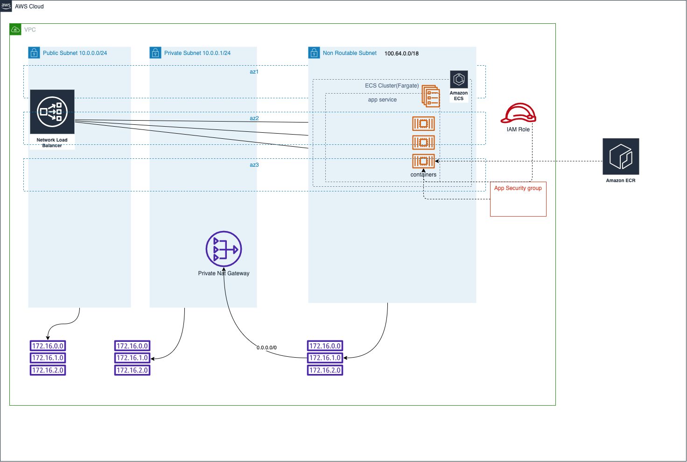

# Running Non Routable IP Containers with Private NatGateway

This is a repo to show you how to run non-routable IP containers in AWS ECS with private natgateway

## Solution Overview


## Dependency

### Setup Infra

See [infra README](.infra/README.md)

### SSM Parameters

* Create Relevant SSM used by this cloudformation

## Prerequisites

### Setup CLI environment

```bash
export AWS_ACCESS_KEY_ID=""
export AWS_SECRET_ACCESS_KEY=""
export AWS_SESSION_TOKEN=""
aws sts get-caller-identity
```

### Setup Build Tool

```bash
pip install aws-sam-cli | brew install aws-sam-cli
```

## Deploy

### Local

```bash
sam build && sam deploy --guided
or
sam build && sam deploy --config-env pv-test
```
